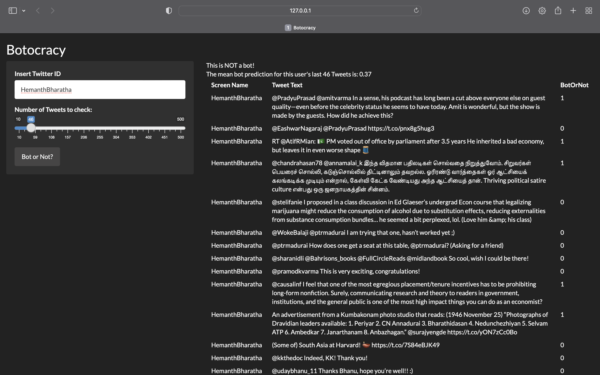
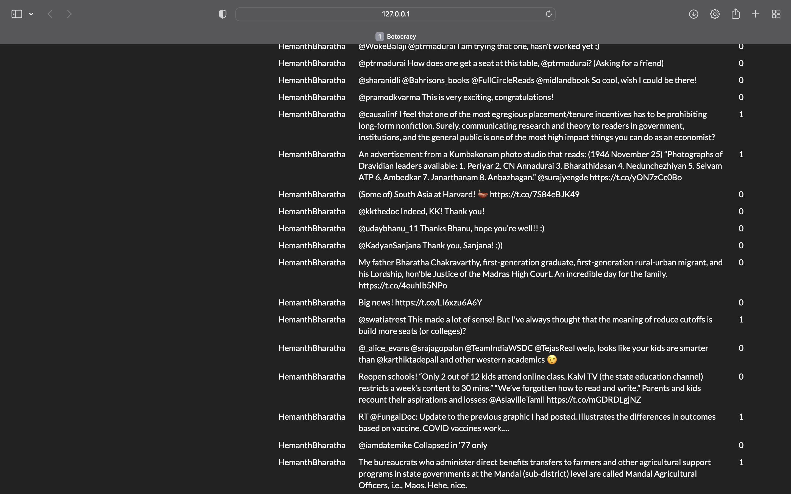
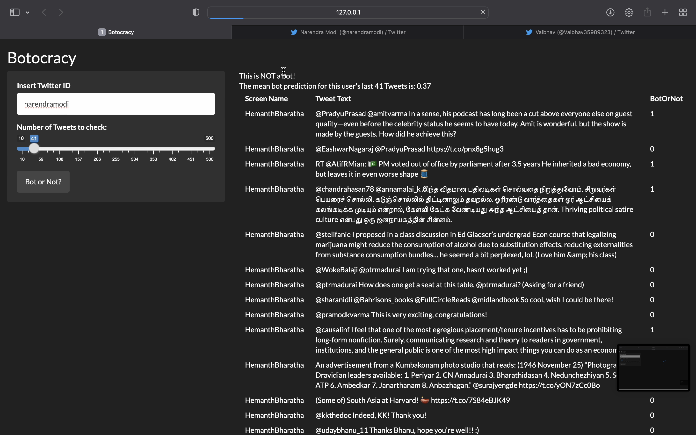
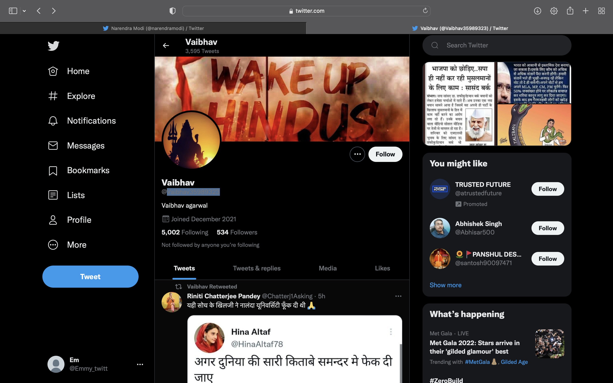
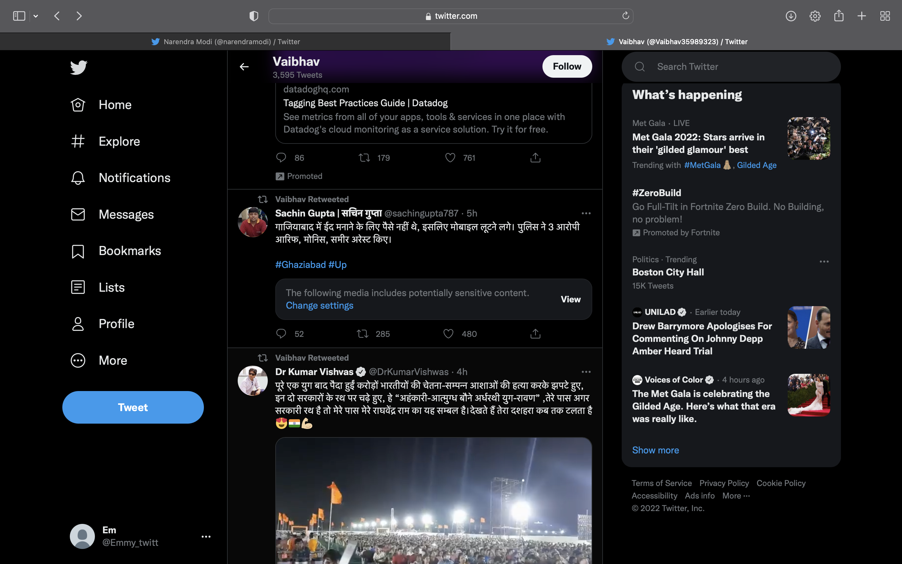
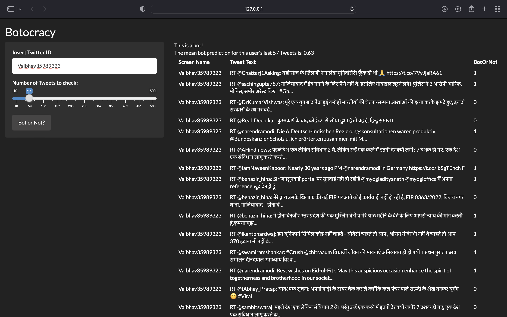
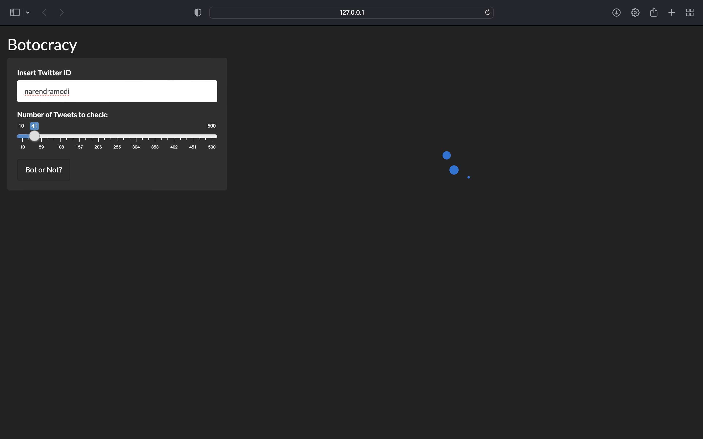

# Botocracy

***By: Hemanth Bharatha Chakravarthy & Em McGlone***

*2 May, 2022. All errors are our own.*

## Deliverables

-   `botocracy.PDF` is the final paper deliverable. It is a self-standing document that outlines the data, wrangling, feature engineering, models tried, model evaluation, and model choice and discussion of the same. It is our primary output.
-   `/shiny/` is the final deliverable Shiny app. As we use a unique Python-R hybrid back-end, Shiny's default domain API does not have capacity to run this app. Hence, the app is run locally and screen recordings are submitted in `/demo/`.

## File structure

-   `/data/` contains the raw data files and sampling code
-   `/shiny/` contains the Shiny app that can be run locally with included installs and the setup of a Python Conda environment via a R `reticulate` environment
-   `/paper/` contains the Rmd with the model evaluation that yields the final PDF as well as \LaTeX style files
-   `/demo/` contains demos of the Shiny app recorded

## Demo (screenshot explanation)

The Shiny App takes a Twitter username and a number of Tweets to check and returns:

1.  An overall prediction if the user is a bot and the mean bot score they attained from the tuned Random Forest model run on the important principal components of BERT word embeddings of user tweets combined with their metadata such as followers count, friends count, favorites count, number of days the account has existed, whether they have the 8-digit serial number that Twitter auto-generates for non-custom usernames, and so on.
2.  The set of requested `n` tweets from the user and the bot prediction (1 or 0) for each Tweet (based along with the relevant metadata of each tweet)

### Example 1: @HemanthBharatha

{width="557"}

{width="557"}

### Example 2: @narendramodi

{width="557"}

### Example 3: a BJP fan

{width="557"}

{width="557"}

{width="557"}

### Example loading screen

{width="518"}
